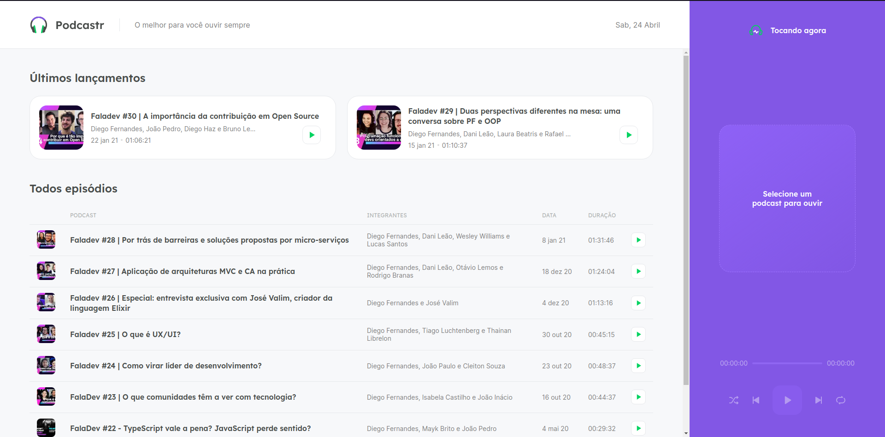
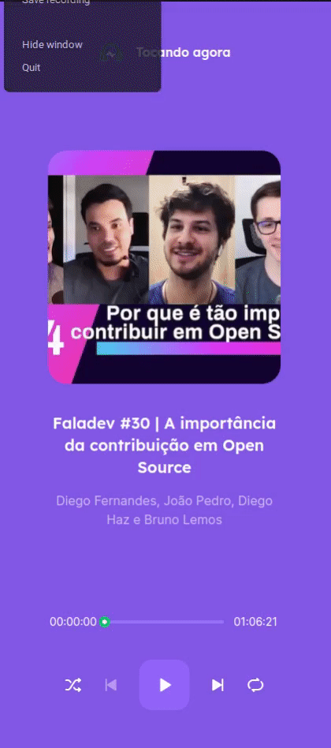

# Podcastr

> Aplicação de podcast realizada durante a NLW 5

## Instalação

Baixe o projeto

```bash
git clone git@github.com:marcosmacedoo/podcastr.git
```

Instale as dependências

```bash
yarn
# ou
npm install
```

Deixe executando o servidor do `server.json`

```bash
yarn server
# ou
npm run server
```

E agora execute o servidor de desenvolvimento do NextJS

```bash
yarn dev
# ou
npm run dev
```


## Funcionamento

**Página Incial**



**Player do podcast**




## Funcionalidades

- [x] Reproduzir podcast
- [x] Repetir um podcast
- [x] Avançar para o próximo podcast
- [x] Voltar para o podcast anterior
- [x] Tornar a playlist aleatória
- [x] Controlar a reprodução do podcast
- [x] Ver detalhes de um podcast
